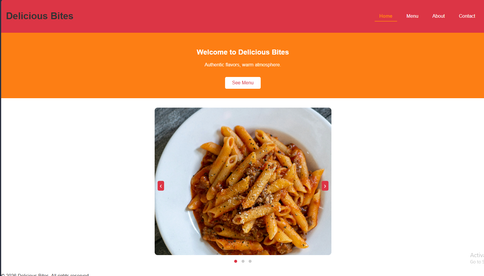
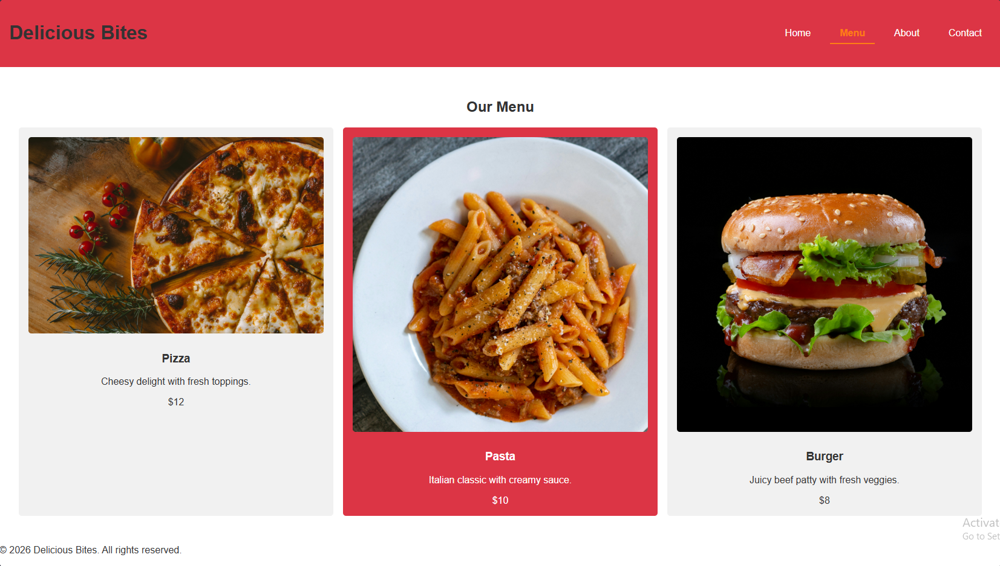
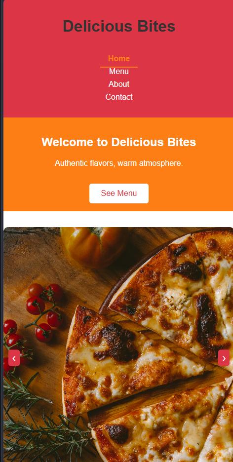

# Multi-Page Restaurant Website - Delicious Bites

## Overview

A responsive, multi-page restaurant website with a homepage slider, menu, about, and contact pages. Built to demonstrate multi-page navigation and interactivity.

## Features

- Homepage with hero section and image slider
- Menu page with grid layout of dishes
- About page with restaurant story and photos
- Contact page with form and map
- Responsive design with media queries
- Warm color palette (red, orange, brownish gray)

## Tech Stack

- HTML5
- CSS3 (Grid, Flexbox, media queries)
- JavaScript (image slider)

## Deployment

- Live Demo: [Demo Link Here](https://restaurant-website-iota-tan.vercel.app/)
- GitHub Repo: [Repo Link Here](https://github.com/Momna533/restaurant-website)

## Screenshots

## Author

Momna Ijaz – Frontend Developer
